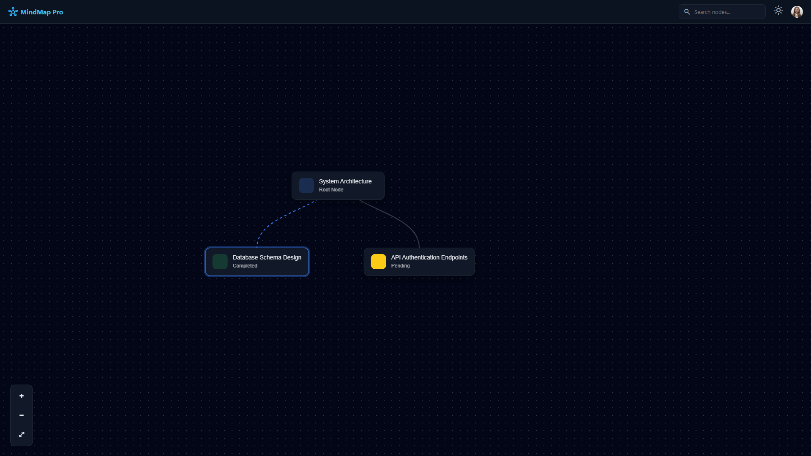

# 🧠 MindMap Pro – Interactive Mind Map Application

MindMap Pro is an interactive web-based mind mapping tool that allows users to visualize, manage, and edit hierarchical tasks with smooth zooming, panning, and contextual side-panel editing.

---

## 📸 Screenshots

### Main Mind Map View (Dark Mode)



### Node Selection & Sidebar Details


### Editing a Node


### Light Mode View


---

## 🎥 Demo Video

▶️ **Watch here:**  
[Demo Video Link](https://drive.google.com/file/d/1SmMKifReBGkwe_fnne-fNotAkV12_UMD/view?usp=sharing)

---

## Technologies Used

- **React (Functional Components)**
- **JavaScript (ES6+)**
- **CSS (Custom Styling)**
- **JSON** (static data source for mind map structure)

---

## Libraries Used (and Why)

- **React Hooks**
  - `useState` – Manages selected node, collapsed nodes, zoom, pan, and UI state
  - `useEffect` – Handles data initialization and layout recalculation
  - `useRef` – Enables smooth panning and efficient DOM interaction

❌ No external graph/visualization libraries were used  
✅ Full control over layout, performance, and extensibility

---

## Architecture & Approach

```text
MindMapView (Root)
├── Canvas (Nodes, edges, zoom & pan)
└── Sidebar (Node details & editing)
```

### Design Principles

- **Single Source of Truth** (JSON-driven tree)
- **Recursive Rendering** for unlimited depth
- **Clear separation** of data, UI, and styles

---

## Data Flow: JSON → UI

1. Mind map structure is defined in JSON
2. Root node is loaded into React state on mount
3. Node positions are calculated using depth & sibling order
4. Nodes and edges are rendered dynamically
5. User interactions update state → UI re-renders instantly

---

## How to Run Locally

### Prerequisites

- Node.js (v16+ recommended)
- npm or yarn

### Steps

```bash
# Clone the repository
git clone https://github.com/asoleshubham0125/Mindmap-Explorer.git

# Navigate to project directory
cd frontend

# Install dependencies
npm install

# Start development server
npm start

The app will be available at:
👉 http://localhost:3000
```

## Why This Design

- ✅ **Scalable for large mind maps**
- ✅ **Lightweight & performant**
- ✅ **Easy to maintain and extend**
- ✅ **Clean UX with minimal dependencies**
